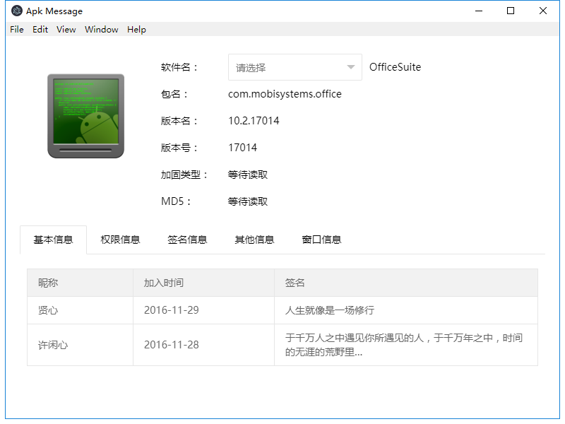

# APKmesseng-erelectron

使用electron版本构建的APKmesseng，除了界面好看一点，一无是处

本来想开发跨平台的apk文件信息读取工具的，没想到这个打包出来100多M，溜了溜了

嗯，开源吧，不玩这个了。

## 已实现功能

通过cmd调用aapt，并且正常显示为中文
正常读取apk包名，版本，版本号，应用名等
可以读取apk里面的图片并显示，代码有写，但是没有具体操作，里面给注释了

electron正常调用jQuery和layer以及layui

文件关联也预留了接口，能读取命令行传来的参数

能对apk里面的文件进行遍历，其他的功能自己实现吧，啊好累

文件拖放功

## 成品

这个不打算做成品了，大家可以访问 https://apk.ghpym.com 下载用于生产环境的软件